# 💰 Expense Tracker

A full-stack personal finance application built on the MERN stack. Users register, record income and expense transactions, filter and export them, and analyse their spending through interactive charts — with JWT-authenticated, per-user data isolation throughout.

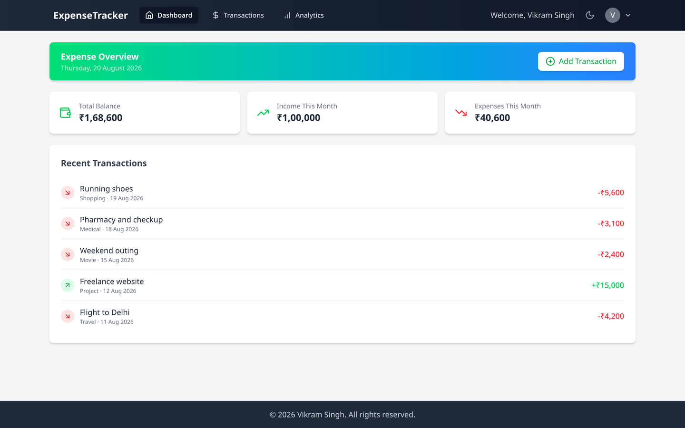

---

## 📸 Screenshots

<table>
  <tr>
    <td width="50%"><strong>Dashboard</strong><br/></td>
    <td width="50%"><strong>Dashboard — dark mode</strong><br/>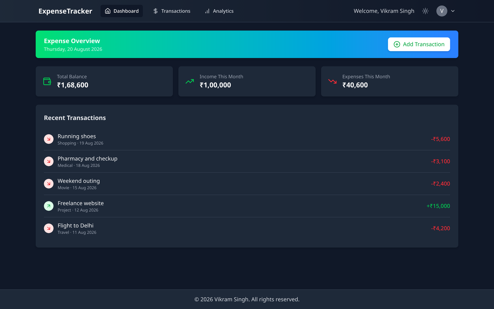</td>
  </tr>
  <tr>
    <td><strong>Analytics</strong><br/>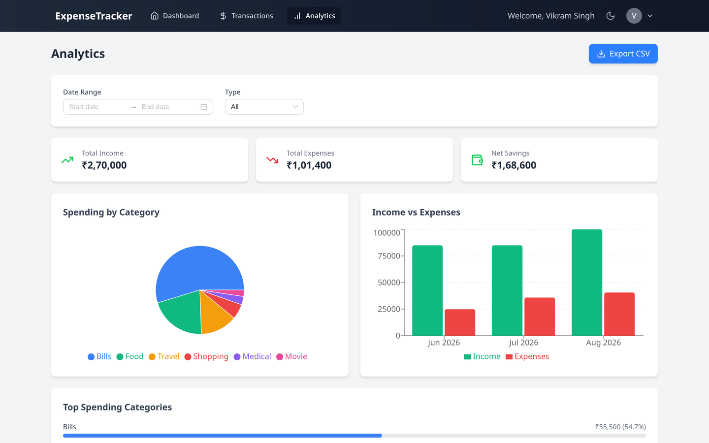</td>
    <td><strong>Analytics — dark mode</strong><br/>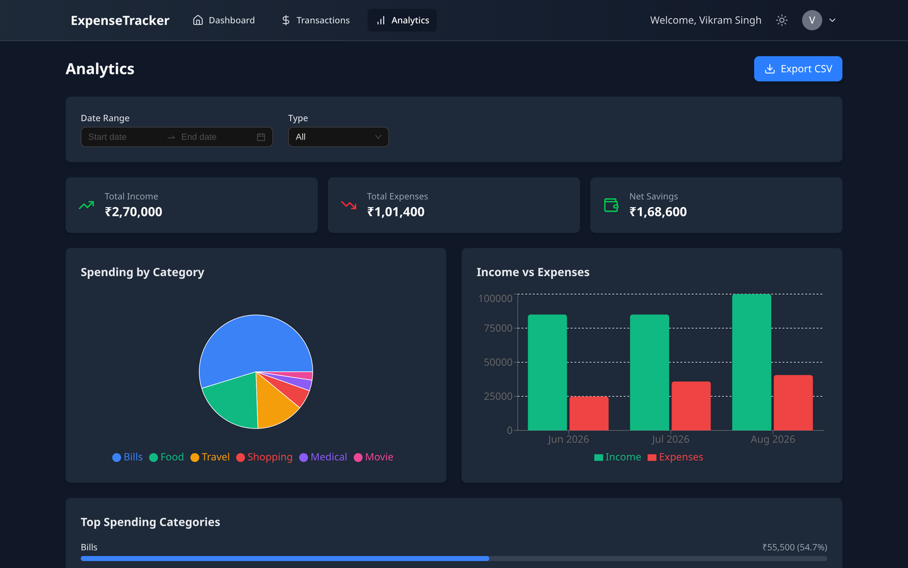</td>
  </tr>
  <tr>
    <td><strong>Transactions</strong><br/>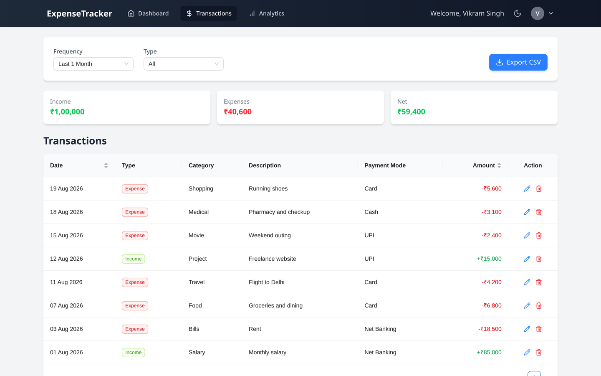</td>
    <td><strong>Transactions — dark mode</strong><br/>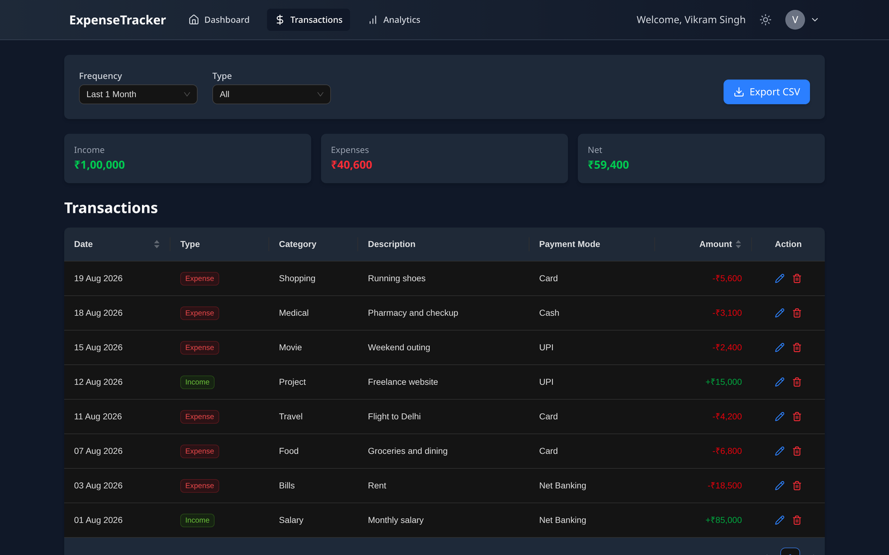</td>
  </tr>
  <tr>
    <td><strong>Add transaction</strong><br/>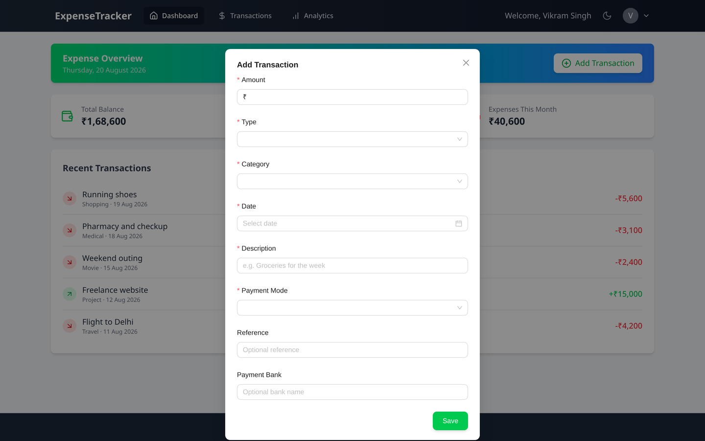</td>
    <td><strong>Sign in</strong><br/>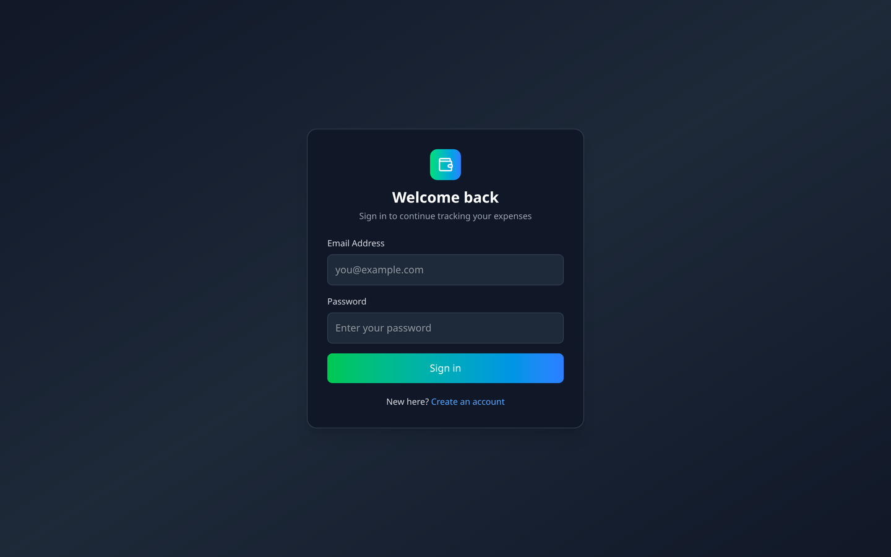</td>
  </tr>
</table>

<p align="center">
  <strong>Responsive on mobile</strong><br/>
  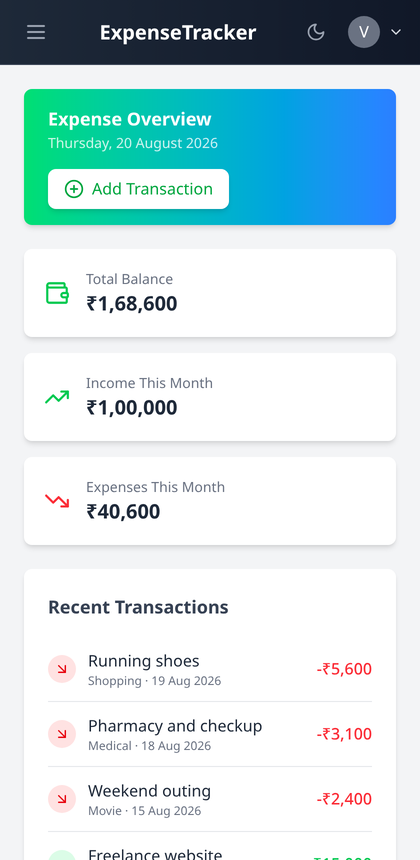
</p>

---

## ✨ Features

| Feature | Description |
| --- | --- |
| **Authentication** | Register / log in with JWT (7-day expiry). Passwords hashed with bcrypt; tokens attached automatically to every request and cleared on expiry. |
| **Transaction management** | Full CRUD — add, edit and delete income/expense records with amount, category, date, payment mode, bank and reference. |
| **Dashboard** | Live total balance, income this month and expenses this month, plus a recent-transactions feed. |
| **Filtering** | Filter by type (income/expense/all) and by period (last week / month / year, or a custom date range). |
| **Analytics** | Category-wise spending pie chart, month-by-month income-vs-expense bar chart, and a ranked "top spending categories" breakdown. |
| **CSV export** | Download the current filtered view from either the Transactions or Analytics page. |
| **Profile & settings** | Update display name, change password (requires current password), toggle theme. |
| **Dark mode** | App-wide, persisted to `localStorage`, defaults to the OS preference, and synced across both Tailwind and Ant Design components. |
| **Responsive** | Mobile navigation drawer, horizontally scrollable tables, fluid grids. |

---

## 🏗️ Architecture

```
ExpenseTracker/
├── Client/                     React SPA (Vite)
│   └── src/
│       ├── api/axios.js        Single axios instance + JWT / 401 interceptors
│       ├── components/         Layout, route guards, theme bridge, shared UI
│       ├── constants/          Category & payment-mode option lists
│       ├── context/            Auth + Theme state (Context API)
│       ├── pages/              One component per route (lazy-loaded)
│       └── utils/              Currency formatting
├── Server/                     Express REST API
│   ├── app.js                  Express app (exported for tests)
│   ├── server.js               Env validation, DB connect, listen
│   ├── config/connectDB.js     Mongoose connection
│   ├── controllers/            Request handlers
│   ├── middleware/             JWT auth guard + express-validator rules
│   ├── models/                 Mongoose schemas
│   ├── routes/                 Route definitions
│   └── __tests__/              Jest + Supertest integration tests
└── docs/screenshots/           Images used by this README
```

`app.js` is deliberately separate from `server.js` so the test suite can import the Express app without opening a port or connecting to the real database.

---

## 🔄 How it works

### System overview

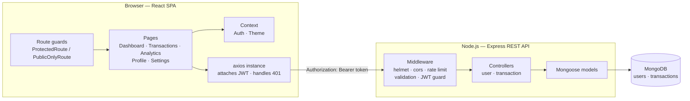

### Authentication — how a session starts

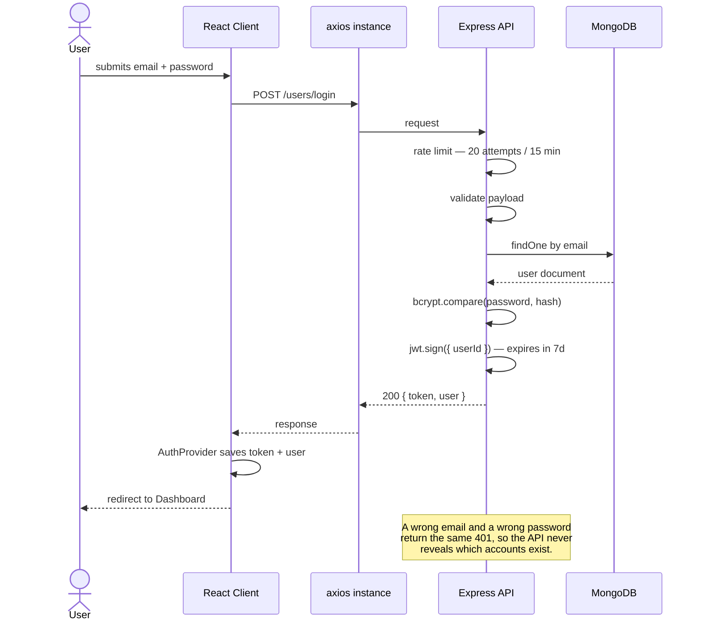

### Authorization — how every later request is scoped

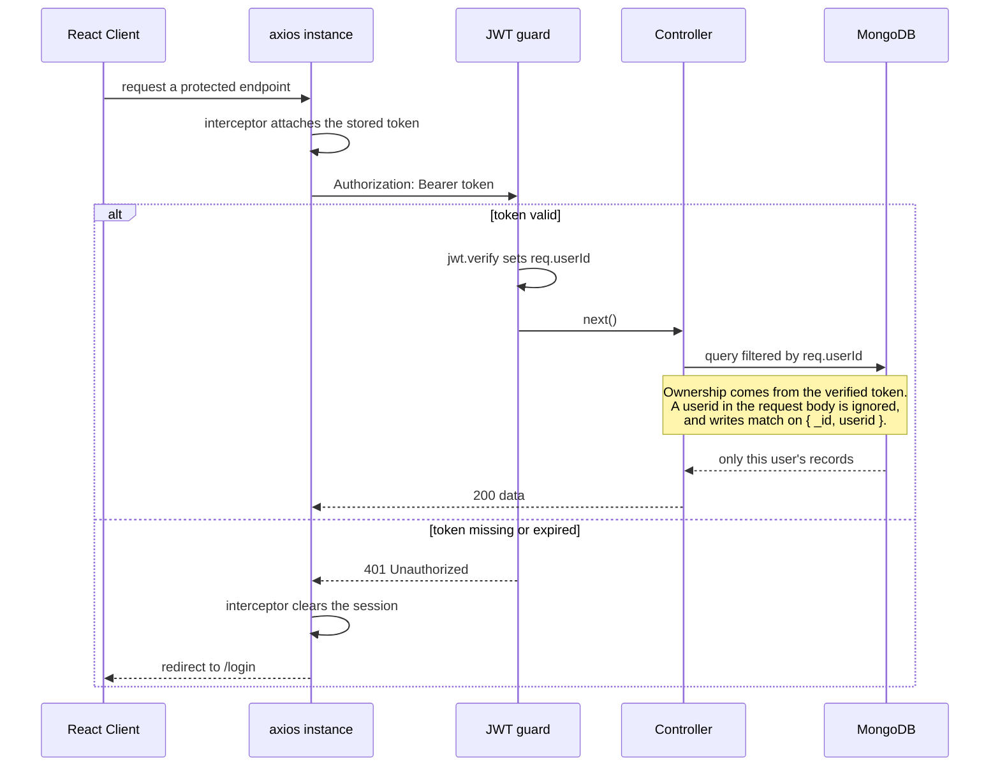

### Request pipeline

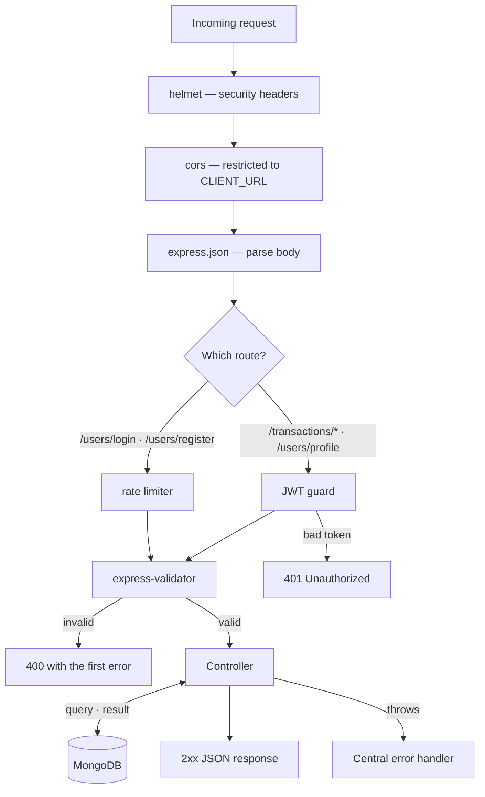

### Navigation and route guards

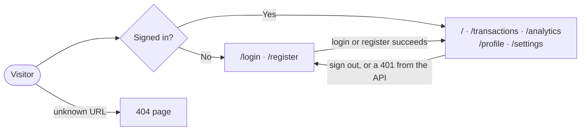

---

## 🛠️ Tech stack — what's used and where

### Frontend

| Technology | Where it's used | Why |
| --- | --- | --- |
| **React 19** | Whole SPA | Component model + hooks for local and shared state. |
| **Vite 6** | Build tooling, dev server | Fast HMR; its dev proxy forwards `/api` to the backend so there are no CORS issues locally. |
| **React Router 7** | `App.jsx` | Client-side routing, route guards (`ProtectedRoute` / `PublicOnlyRoute`), 404 catch-all. |
| **Context API** | `context/AuthProvider`, `context/ThemeProvider` | Shares the signed-in user and theme without prop-drilling. Chosen over Redux — the app has little global state, so Redux would be overhead. |
| **Axios** | `api/axios.js` | One configured instance; a request interceptor attaches the JWT and a response interceptor force-logs-out on `401`. |
| **Tailwind CSS 4** | All layout and styling | Utility-first styling; dark mode driven by a `.dark` class on `<html>` via a `@custom-variant`. |
| **Ant Design 5** | Table, Modal, Form, Select, DatePicker | Production-grade complex widgets (sorting, pagination, validation) that would be slow to hand-roll. `AntdThemeProvider` keeps its tokens in sync with the app theme. |
| **Recharts** | `pages/Analytics.jsx` | Declarative, composable React charts (pie + bar). |
| **Lucide React** | Icons throughout | Lightweight, consistent icon set. |
| **Day.js** | Date parsing/formatting everywhere | Much smaller than Moment (which was removed) and it's what Ant Design's DatePicker already uses. |
| **React Hot Toast** | Success/error feedback | Non-blocking notifications. |
| **PapaParse + FileSaver** | CSV export | Serialises transactions and triggers the browser download. |
| **ESLint 9** | `npm run lint` | Flat config with React, Hooks and Fast-Refresh rules. |

### Backend

| Technology | Where it's used | Why |
| --- | --- | --- |
| **Node.js + Express 4** | `app.js`, `routes/` | Minimal, well-understood REST layer. |
| **MongoDB + Mongoose 8** | `models/` | Flexible document store; Mongoose adds schema validation and a compound index on `{ userid, date }`. |
| **jsonwebtoken** | `controllers/userController.js`, `middleware/authMiddleware.js` | Stateless auth — the server needn't store sessions. |
| **bcryptjs** | `controllers/userController.js` | Salted password hashing (10 rounds). Chosen over `bcrypt` because it's pure JS — no native build step and no vulnerable install-time dependencies. |
| **express-validator** | `middleware/validators.js` | Declarative request validation before anything reaches a controller. |
| **helmet** | `app.js` | Sets hardening HTTP headers. |
| **express-rate-limit** | `routes/userRoute.js` | Caps login/register at 20 attempts per 15 min per IP to blunt brute-force attacks. |
| **cors** | `app.js` | Restricted to `CLIENT_URL` rather than wide open. |
| **morgan** | `app.js` | Request logging (disabled during tests). |
| **Jest + Supertest + mongodb-memory-server** | `__tests__/` | Integration tests hit real routes against a throwaway in-memory MongoDB, so they never touch production data. |

---

## 🔐 Security

- **Per-user data isolation.** Transaction ownership is derived from the verified JWT (`req.userId`), never from the request body. Update and delete queries match on `{ _id, userid }`, so one user cannot read or modify another's records even by supplying someone else's ID. This is covered by regression tests.
- **Password hashing.** bcrypt with a per-password salt; hashes are never returned by any endpoint.
- **No user enumeration.** Wrong email and wrong password both return the same generic `401`.
- **Input validation** on every write endpoint via express-validator.
- **Rate limiting** on the authentication endpoints.
- **Secrets stay out of git** — `.env` is git-ignored; use `.env.example` as the template.

> **Note on `npm audit`:** a small number of advisories remain in the frontend's *development* dependencies (the ESLint tool-chain) and in `react-router`, whose only reported issue affects React Server Components — a feature this SPA does not use, and for which no patched release exists. Nothing shipped to the browser or the server is affected.

---

## 📦 Getting started

### Prerequisites
- Node.js 18+
- A MongoDB database (local, or a free MongoDB Atlas cluster)

### 1. Clone and install
```bash
git clone https://github.com/VikramSinghRakwal06/ExpenseTracker.git
cd ExpenseTracker

npm install                 # root (concurrently)
npm install --prefix Server
npm install --prefix Client
```

### 2. Configure the backend
```bash
cp Server/.env.example Server/.env
```

Fill in `Server/.env`:

| Variable | Description |
| --- | --- |
| `PORT` | API port (default `9090`). |
| `MONGODB_URL` | Your MongoDB connection string. |
| `JWT_SECRET` | Long random string. Generate one with `node -e "console.log(require('crypto').randomBytes(32).toString('hex'))"`. |
| `CLIENT_URL` | Frontend origin for CORS (`http://localhost:5173` in development). |

The server refuses to start if `MONGODB_URL` or `JWT_SECRET` is missing.

### 3. Configure the frontend (optional in development)
```bash
cp Client/.env.example Client/.env
```
Leave `VITE_API_URL` empty locally — Vite's dev proxy forwards `/api` to the backend. For a deployed build, set it to your API's public URL (e.g. `https://your-api.onrender.com/api/v1`).

### 4. Run
```bash
npm run dev        # starts API (:9090) and client (:5173) together
```

Open <http://localhost:5173>.

### Other commands
```bash
npm test                        # backend test suite
npm run build                   # production frontend build
npm run lint --prefix Client    # lint the frontend
```

---

## 🔌 API reference

Base URL: `/api/v1`. Endpoints marked 🔒 require an `Authorization: Bearer <token>` header.

| Method | Endpoint | Description |
| --- | --- | --- |
| `GET` | `/health` | Service health check. |
| `POST` | `/users/register` | Create an account. Returns a JWT and the user. |
| `POST` | `/users/login` | Authenticate. Returns a JWT and the user. |
| `PATCH` | `/users/profile` 🔒 | Update the display name. |
| `PATCH` | `/users/password` 🔒 | Change password (requires the current one). |
| `POST` | `/transactions/get-transactions` 🔒 | List the caller's transactions, optionally filtered by `type`, `frequency` or a custom `selectedDate` range. |
| `POST` | `/transactions/add-transaction` 🔒 | Create a transaction. |
| `PUT` | `/transactions/update-transaction/:id` 🔒 | Update a transaction the caller owns. |
| `DELETE` | `/transactions/delete-transaction/:id` 🔒 | Delete a transaction the caller owns. |

---

## 🧪 Testing

```bash
npm test
```

Jest + Supertest run against an in-memory MongoDB instance. Coverage includes registration and login (including validation failures and the generic-error path), the authentication guard, transaction CRUD, and explicit regression tests proving one user cannot read, update or delete another user's transactions.

---

## 🚀 Deployment notes

- **Backend** (Render / Railway / Fly): set `MONGODB_URL`, `JWT_SECRET`, `CLIENT_URL` and `NODE_ENV=production`; start with `npm start`.
- **Frontend** (Vercel / Netlify): build with `npm run build`, publish `Client/dist`, and set `VITE_API_URL` to the deployed API base URL. Add a SPA rewrite (all paths → `/index.html`) so client-side routes resolve on refresh.

---

## 📄 License

ISC — see the repository for details.
